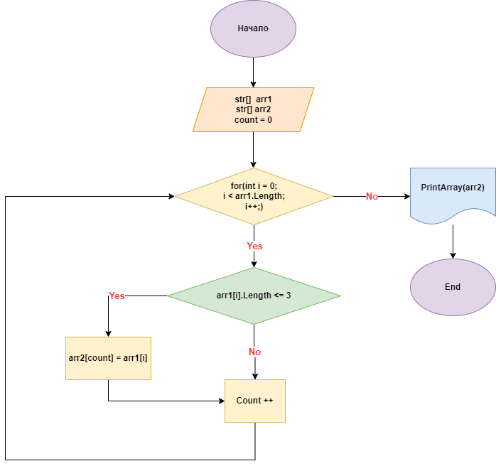

# Итоговая проверочная работа.

1. Создать репозиторий на GitHub
2. Нарисовать блок-схему алгоритма (*можно обойтись блок-схемой основной содержательной части, если вы выделяете её в отдельный метод*)
3. Снабдить репозиторий оформленным текстовым описанием решения (*файл README.md*)
4. Написать программу, решающую поставленную задачу
5. Использовать контроль версий в работе над этим небольшим проектом (*не должно быть так, что всё залито одним коммитом, как минимум этапы 2, 3, и 4 должны быть расположены в разных коммитах*)

Задача: Написать программу, которая из имеющегося массива строк формирует новый массив из строк, длина которых меньше, либо равна 3 символам. Первоначальный массив можно ввести с клавиатуры, либо задать на старте выполнения алгоритма. При решении не рекомендуется пользоваться коллекциями, лучше обойтись исключительно массивами.

Примеры :relaxed::

```
[“Hello”, “2”, “world”, “:-)”] → [“2”, “:-)”]

[“1234”, “1567”, “-2”, “computer science”] → [“-2”]

[“Russia”, “Denmark”, “Kazan”] → [] 
```

## Решение:

1. ***[Создал репозиторий на GitHub](https://github.com/dmitrycd838/intermediate-certification.git)***

2. ***Нарисовал блок-схему алгоритма***: 



3. ***Программа, решающая поставленную задачу***

```C#
string[] arr1;
System.Console.WriteLine("Введите значения строк через пробел для формирования первоначального массива: ");
string inputStrings = Console.ReadLine()!;
arr1 = inputStrings !.Split(' ');

string[] arr2 = new string[arr1.Length];

FillSecondArray(arr1, arr2);
PrintArray(arr2);

void FillSecondArray(string[] arr1, string[] arr2)
{
    int i = 0;
    for (int j = 0; j < arr1.Length; j++)
    {
        if (arr1[j].Length <= 3)
            {
                arr2[i] = arr1[j];
                i++;
            }
    }
}

void PrintArray(string[] array)
{
    System.Console.WriteLine("Вывод массива из строк, длина которых меньше либо равна 3 символам: ");
    for (int i = 0; i < array.Length; i++)
    {
        System.Console.Write($"{array[i]} ");
    }
}
```

